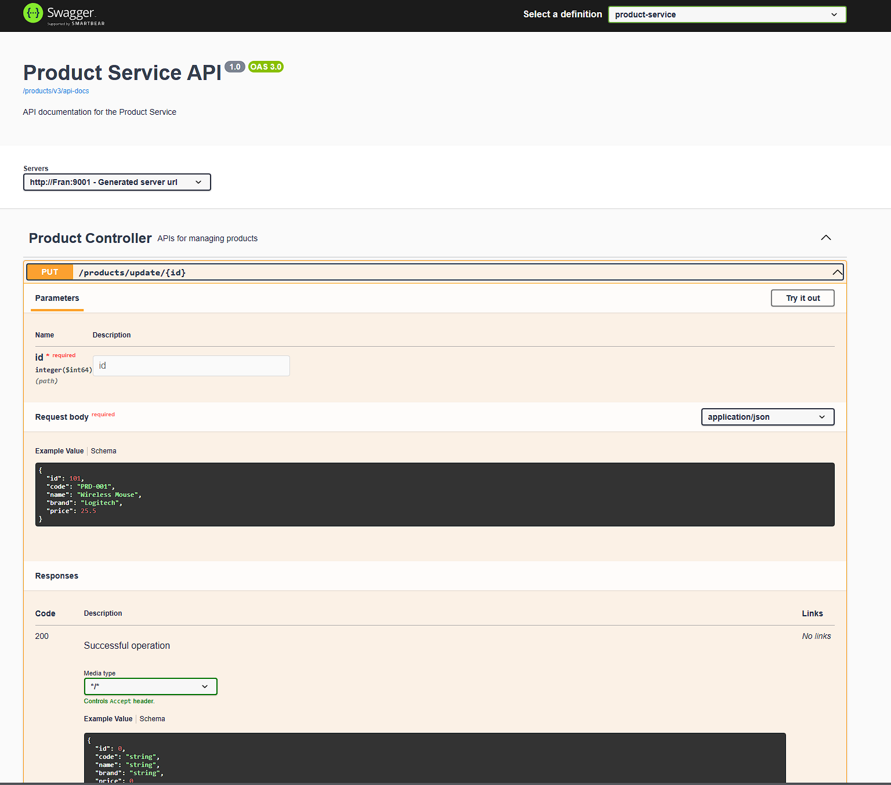
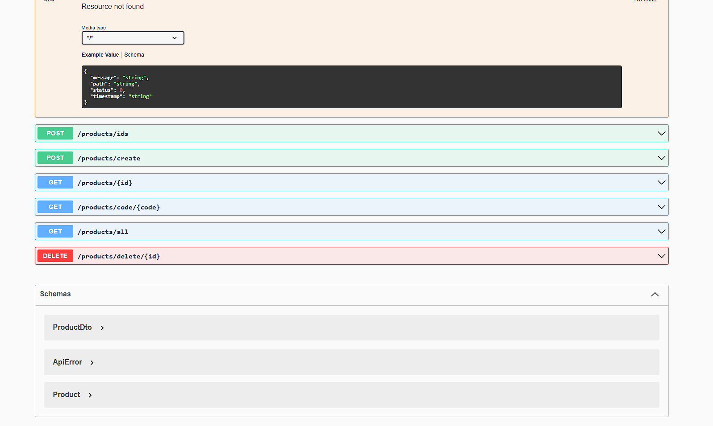
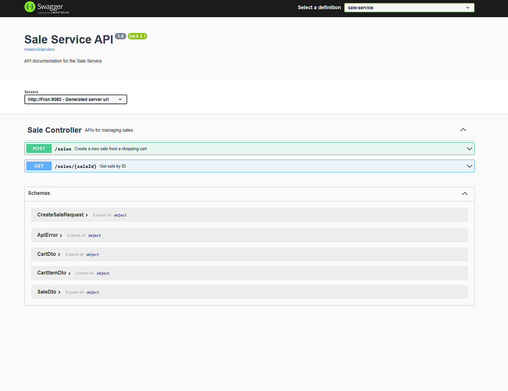
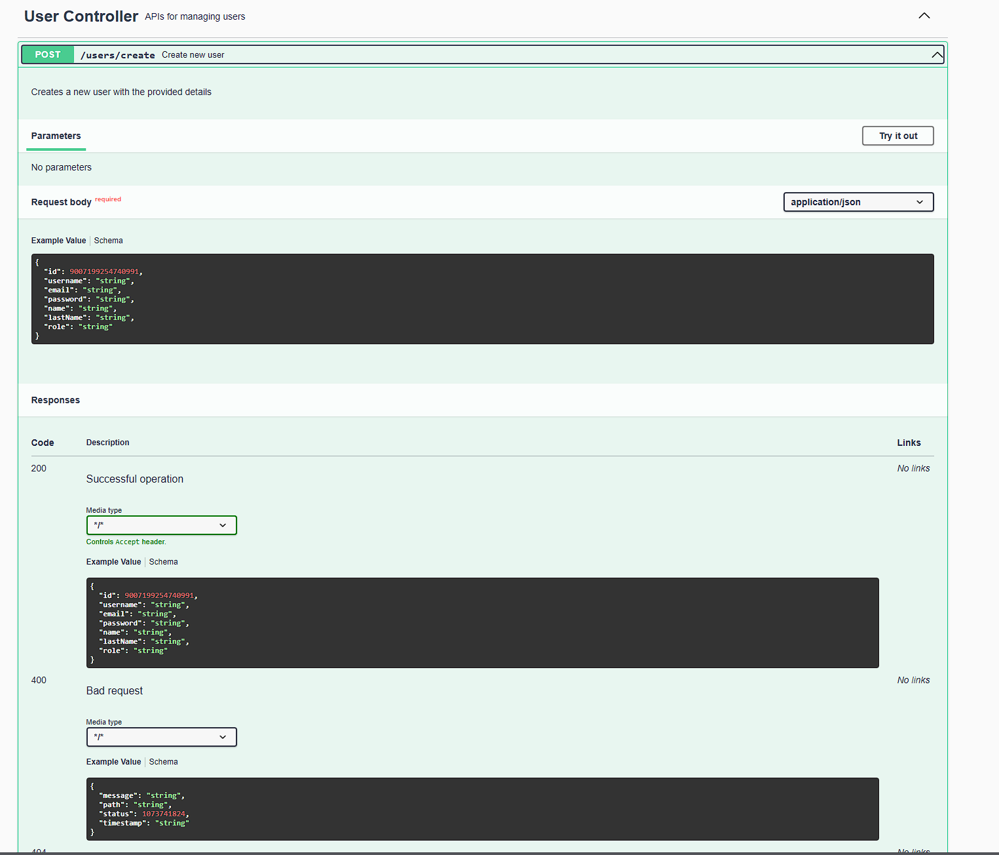
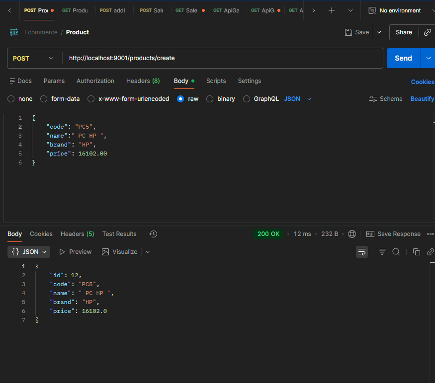
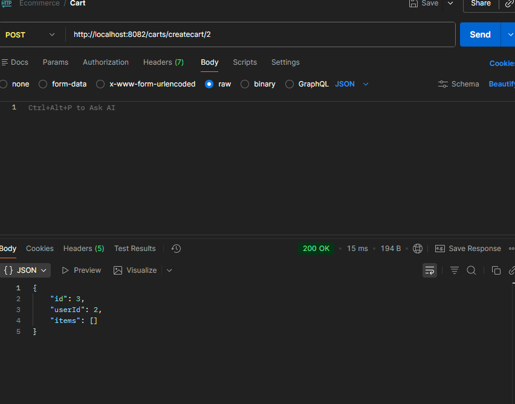
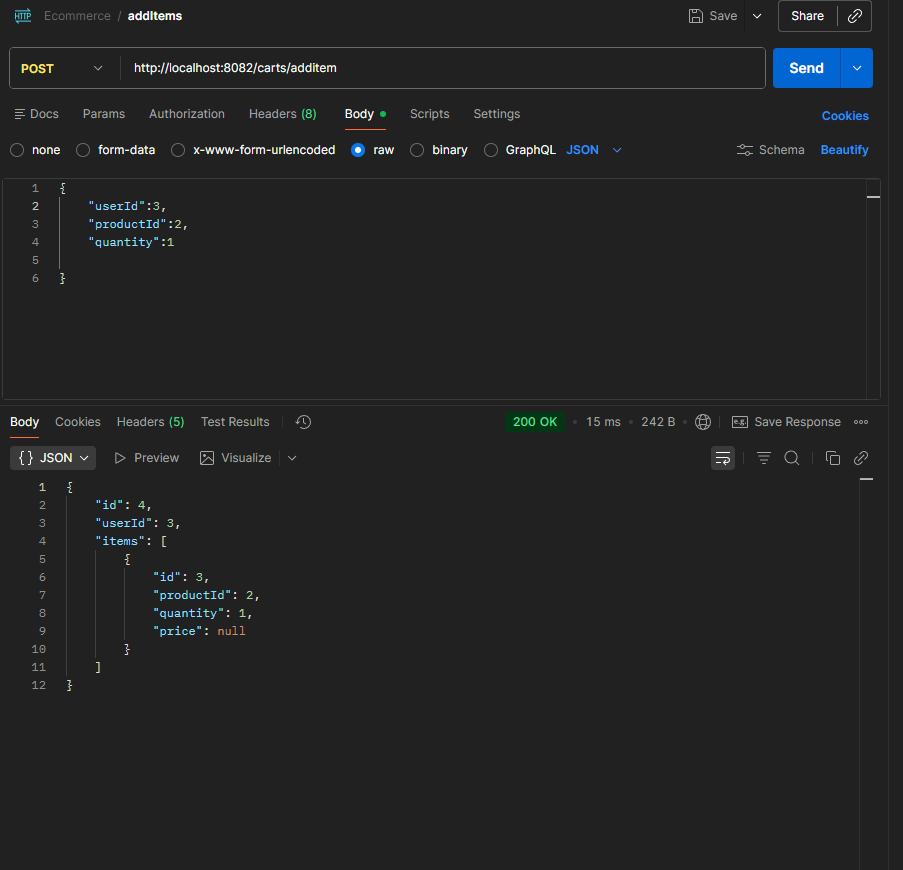
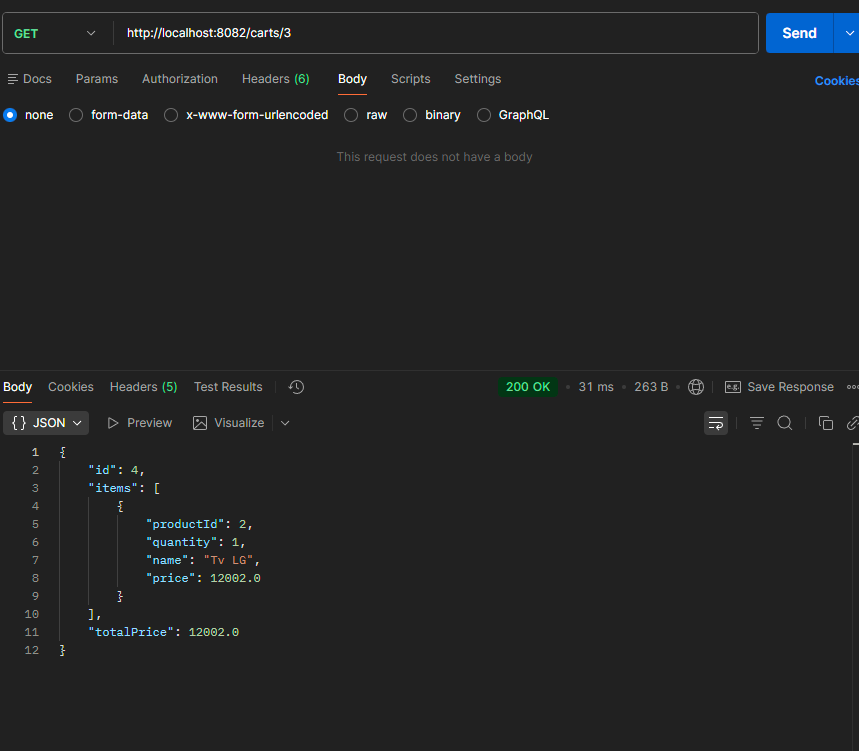

# Ecommerce Microservices API (Spring Cloud)

Backend de e-commerce construido con **arquitectura de microservicios** usando **Spring Boot + Spring Cloud**.
Incluye **Service Discovery (Eureka)**, **API Gateway**, **Load Balancing**, persistencia en **MySQL**, y documentación **OpenAPI/Swagger** centralizada.

---

## 🧩 Arquitectura


Servicios incluidos:

- **Eureka Server** (`eureka-sv`) → Service Discovery
- **API Gateway** (`ApiGateway`) → Entry point + ruteo por paths
- **Product Service** (`product-service`) → Catálogo (2 instancias)
- **ShoppingCart Service** (`shoppingcart-service`) → Carrito
- **Sale Service** (`sale-service`) → Ventas
- **User Service** (`user-service`) → Usuarios
- **MySQL** (`mysql`) → Una instancia, múltiples schemas (una DB por servicio)

---


## 🧰 Tech Stack

- Java 17/21 (runtime en Docker)
- Spring Boot
- Spring Cloud:
  - Eureka Server/Client
  - Spring Cloud Gateway (WebMVC)
  - LoadBalancer
  - OpenFeign (comunicación entre servicios)
- MySQL 8.x
- OpenAPI 3 / Swagger UI (springdoc)

---

## ✅ Servicios incluidos

| Servicio | Responsabilidad | Ruta por Gateway |
|---------|------------------|------------------|
| `eureka-sv` | Service Discovery | (UI) `http://localhost:8761` |
| `ApiGateway` | Entrada única a la API + ruteo | `http://localhost:443` |
| `product-service` | Productos | `/products/**` |
| `shoppingcart-service` | Carritos | `/carts/**` |
| `sale-service` | Ventas/órdenes | `/sales/**` |
| `user` | usuarios | `/users/**` |
| `mysql` | Base de datos | host: `3307` (container: `3306`) |

---

## 🚀 Quick Start (Docker)

### 1) Requisitos
- Docker Desktop instalado y corriendo
- Docker Compose (v2)

### 2) Variables de entorno
En la raíz del proyecto existe un `.env` :

```env
DB_USERNAME=root
DB_PASSWORD=root
```
## Inicializacion de bases (mysql-init)

Este repo incluye una carpeta mysql-init/ para crear las bases al iniciar MySQL.

## Levanta todo 
Desde la carpeta raiz 

- docker compose up --build

## URLs cuando corre Docker

- Gateway (API entrypoint)
 http://localhost:443

- Eureka Dashboard
 http://localhost:8761

-Swagger UI (centralizado)
 http://localhost:443/swagger-ui/index.html

-OpenAPI JSON (Gateway)
 http://localhost:443/v3/api-docs


## Documentacion con OpenApo/Swagger
Cada microservicio expone su OpenAPI (/v3/api-docs) y el Gateway centraliza la documentación para navegarla desde una sola UI.

- Swagger UI: http://localhost:443/swagger-ui/index.html

- Docs individuales :

- http://localhost:443/products/v3/api-docs

- http://localhost:443/carts/v3/api-docs

- http://localhost:443/sales/v3/api-docs

-http://localhost:443/users/v3/api-docs


##  Cómo probar (rápido)

Una vez levantado con Docker:

- Swagger (Gateway): http://localhost:443/swagger-ui/index.html


```bash
# Productos
curl -i http://localhost:443/products/all

# Carritos
curl -i http://localhost:443/carts/1

# Ventas
curl -i http://localhost:443/sales/1

# Usuarios
curl -i http://localhost:443/users/all

```
##  Asi se ve la documentacion





## Pruebas en Postman

### Creando Producto

### Creando Carrito

### Asignando Producto a Carrito

### Devolviendo carrito completo



